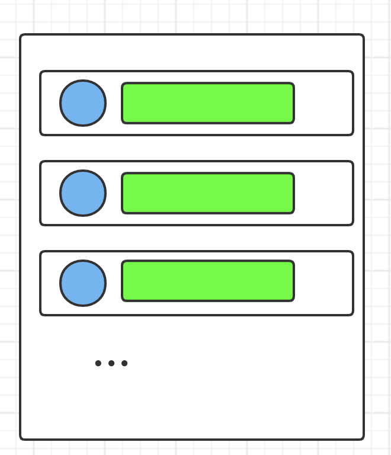
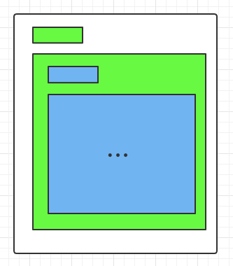

# ConstraintLayout 使用及性能分析

## 一、背景

`ConstraintLayout`对于很多 Android 开发者而言并不陌生，其可以扁平化创建复杂的大型布局，和`RelativeLayout`类似，但是其灵活性有高于`RelativeLayout`，而且在复杂布局中，一般也具有更好的性能，在 [Understanding the performance benefits of ConstraintLayout](https://android-developers.googleblog.com/2017/08/understanding-performance-benefits-of.html) 中举例说明使用`ConstraintLayout`相对于传统布局，性能提升40%左右，然而在[Constraint Layout performance](https://medium.com/android-news/constraint-layout-performance-870e5f238100) 中使用`ConstraintLayout`分别和传统布局`LinearLayout`、`RelativeLayout`进行对比，其性能又低于传统布局，通过实验布局对比，可能会得出一个结论：**复杂布局使用`ConstraintLayout`性能好于传统布局，简单布局情况下优先使用传统布局。**

那么什么情况下布局属于简单布局，什么情况属于复杂布局，这个一般情况下很难衡量，因此本文尝试根据日常项目中的布局情况，结合`ConstraintLayout`功能属性，试图找到一种最优的布局思路。

## 二、准备工作

### 2. 1 View 加载原理

一个View从xml到展示，需要经历四步：


Inflate: IO读取并解析xml文件，构建viewTree。

Measure: 测量View大小，递归调用`measure`方法。

Layout: 根据测量结果，确定View的位置，递归调用`layout`方法。

Draw: 绘制View。ViewRoot创建一个Canvas对象，然后调用OnDraw()。六个步骤：①、绘制视图的背景；②、保存画布的图层（Layer）；③、绘制View的内容；④、绘制View子视图，如果没有就不用；⑤、还原图层（Layer）；⑥、绘制滚动条

### 2.2 布局性能衡量方式

如2.1 所示，一个布局从xml文件到渲染，需要经历四步，因此衡量布局性能就需要统计这四个过程的总时间，目前从一些示例和博客上看到的统计方式有很多，有手动常规打点、AOP插桩、UI自动化、`android.view.Window.OnRestrictedCaptionAreaChangedListener`、SystemTrace工具、Microbenchmark等，对比不同的统计方法，发现Microbenchmark最方便直接。因此本文设计如下基准测试：

```kotlin
object LayoutPerformanceUtils {

    /**
     * 统计分析布局文件加载耗时
     */
    fun analysisLayoutInflate(benchmarkRule: BenchmarkRule, layoutResId: Int) {
        val context = InstrumentationRegistry.getInstrumentation().context
        val inflater = LayoutInflater.from(context)

        benchmarkRule.measureRepeated {
            inflater.inflate(layoutResId, null)
        }
    }

    /**
     * 统计分析布局文件 measure + layout 耗时，原因：
     * 1. 相对于 inflate 而言，measure 和 layout 一般会被同时调用
     * 2. measure 和 layout 对于一些 View 而言，职责并没有特别限定，因此从一些系统代码中可以发现，measure 和 layout存在相互调用的情况
     */
    fun analysisLayoutMeasureAndLayout(
        benchmarkRule: BenchmarkRule,
        layoutResId: Int,
        mode: Int = View.MeasureSpec.EXACTLY
    ) {
        val context = InstrumentationRegistry.getInstrumentation().context
        val inflater = LayoutInflater.from(context)

        benchmarkRule.measureRepeated {
            // Not to use the view cache in the View class, we inflate it every time
            val container = runWithTimingDisabled {
                inflater.inflate(layoutResId, null)
            }
            val widthMeasureSpec = View.MeasureSpec.makeMeasureSpec(1080, mode)
            val heightMeasureSpec = View.MeasureSpec.makeMeasureSpec(1920, mode)

            container.measure(widthMeasureSpec, heightMeasureSpec)
            container.layout(0, 0, container.measuredWidth, container.measuredHeight)
        }
    }

}
```

这些基准测试分别测试布局文件的加载、测量和布局耗时（没有设计关于`draw()`的基准测试，一方面view的绘制方法比较复杂，涉及到的系统交互较多，另一方面对于布局来说，如果没有设置背景的情况下，基本都是依次执行子View的`draw()`，对于测量布局性能数据影响比较小）。此外，基准测试中将`MeasureSpecMode`设置成`EXACTLY`,这是因为一般情况，布局都会作为`Activity`的`contentView`，而且这种情况下布局一般才会比较复杂。

### 三、ConstraintLayout 使用和测量分析

既然使用`ConstraintLayout`，肯定是希望替代传统的`LinearLayout`、`RelativeLayout`，因此本文将设计以下各个场景，并通过2.2 中的基准测试在Android 10 的 onePlus手机上运行，逐步分析`ConstraintLayout`测量和布局效果：

### 3.1 单行展示——子view依次水平展示

单行展示是日常开发中，最常见的一种场景，所有的子view排列成一排。

场景图：


实现：

| 子View   | 设置                                                      |
| -------- | --------------------------------------------------------- |
| TextView | 每个TextView宽高设置wrap_content,默认设置，文字“TextView” |

布局设置：

| 根布局           | 测量模式 | 实现                                                         |
| ---------------- | -------- | ------------------------------------------------------------ |
| linearLayout     | AT_MOST  | 横向，依次增加TextView                                       |
| linearLayout     | EXACTLY  |                                                              |
| RelativeLayout   | AT_MOST  | 依次增加TextView，除第一个TextView外，每个TextView设置，依次紧靠左边TextView |
| RelativeLayout   | EXACTLY  |                                                              |
| ConstraintLayout | AT_MOST  | 依次增加TextView，第一个TextView左上对齐 `parent`,其余TextView依次左边view |
| ConstraintLayout | EXACTLY  |                                                              |

结果：

| 布局                     | TextView个数 |        |        |        |        |         |         |         |               |             |
| ------------------------ | ------------ | ------ | ------ | ------ | ------ | ------- | ------- | ------- | ------------- | ----------- |
|                          | 0            | 1      | 2      | 3      | 4      | 5       | 6       | 7       | 8（宽度1920） | 8(宽度1080) |
| constraintLayout_atMost  | 4,109        | 65,076 | 80,753 | 84,487 | 95,772 | 107,773 | 125,789 | 133,090 | 155,831       | 219,025     |
| constraintLayout_exactly | 4,591        | 36,858 | 50,147 | 70,769 | 83,759 | 88,690  | 101,638 | 112,768 | 124,787       | 125,528     |
| linearLayout_atMost      | 3,137        | 18,321 | 28,354 | 37,123 | 45,781 | 53,576  | 62,488  | 71,238  | 79,131        | 106,699     |
| linearLayout_exactly     | 3,469        | 18,495 | 28,317 | 37,077 | 45,984 | 53,417  | 61,893  | 70,179  | 79,186        | 105,834     |
| relativeLayout_atMost    | 3,503        | 22,466 | 35,466 | 45,427 | 55,998 | 66,105  | 76,029  | 85,193  | 96,341        | 122,213     |
| relativeLayout_exactly   | 3,860        | 22,158 | 35,274 | 45,205 | 56,450 | 65,798  | 75,559  | 85,841  | 95,327        | 121,788     |


从图表数据看，在父布局足够展示子View时，单行展示情况下，几种布局随着子View增加，测量布局耗时随着View个数增加基本呈线性增加（除了添加第一个view），但是有一点需要注意：当父布局宽度不足以展示子View时，`LinearLayout`、`RelativeLayout`、`ConstraintLayout_atMost`测量耗时会急剧增加，而`ConstraintLayout_exactly`则没有，`ConstraintLayout_exactly`测量耗时明显小于`ConstraintLayout_atMost`。

因此，对于单行简单布局而言，`LinearLayout`性能最好，`RelativeLayout`次之，`ConstraintLayout`相对最差。

但是单行展示中，`ConstraintLayout`还提供很多其他功能，如链、百分比占位等，而日常开发中也会经常遇到单行展示控件权重处理，因此对上述场景进行改造：**每个TextView平均分配父布局宽度**，布局实现如下：

| 布局                            | 实现                                   |
| ------------------------------- | -------------------------------------- |
| ConstraintLayout                | 使用链,每个TextView宽度设置0dp         |
| LinearLayout                    | 设置每个TextView  `layout_weight`值为1 |
| ConstraintLayout + LinearLayout | 嵌套LinearLayout                       |

结果：

|                               | 0      | 1      | 2      | 3       | 4       | 5       | 6       | 7       |
| ----------------------------- | ------ | ------ | ------ | ------- | ------- | ------- | ------- | ------- |
| ConstraintLayout              | 4,579  | 40,813 | 83,019 | 112,096 | 145,161 | 158,367 | 240,349 | 280,796 |
| LinearLayout                  | 3,577  | 18,973 | 29,534 | 38,835  | 47,127  | 55,699  | 64,497  | 73,516  |
| ConstraintLayout+LinearLayout | 30,463 | 40,518 | 51,295 | 60,983  | 69,412  | 77,393  | 82,638  | 95,414  |


从测试效果上看，当单行展示并且设置子View权重时，单布局情况下，`LinearLayout`性能更好，相对于链的实现，`ConstraintLayout`嵌套`LinearLayout`效果会更好。

> 备注：
>
> 1. 上述测试时，单行展示并为子View设置权重时，经常可能会设置不同的权重，对于`ConstraintLayout`而言，可以设置`layout_constraintWidth_percent`，个人也测试几次，整体耗时会更高一点，与当前结论也是一致，有兴趣的可以验证一下，这里就不将数据列出来了。

### 3.2 多行展示——子View依次垂直展示

多数场景情况下，界面展示可以划分为不同的行，每行展示一组View，为了验证在多行情况，不同布局测量性能影响，假设每行View一样：

场景图：



实现：

| 子View               | 设置                                                         |
| -------------------- | ------------------------------------------------------------ |
| ImageView + TextView | 每个TextView宽高设置wrap_content,默认设置，文字“TextView”，一个ImageView,宽高20dp，默认设置，文字和图片垂直居中 |

   布局实现：

| 根布局           | 实现                                |
| ---------------- | ----------------------------------- |
| linearLayout     | 竖向，每个子View是一个LiearLayout， |
| RelativeLayout   | 单布局实现                          |
| ConstraintLayout | 单层布局                            |

测量结果：

| View个数         | 0     | 1      | 2      | 3      | 4       | 5       | 6       | 7       |
| ---------------- | ----- | ------ | ------ | ------ | ------- | ------- | ------- | ------- |
| ConstraintLayout | 4,549 | 53,044 | 65,864 | 86,236 | 107,331 | 124,515 | 143,500 | 161,806 |
| LinearLayout     | 3,671 | 23,144 | 36,415 | 48,943 | 61,064  | 73,223  | 85,572  | 98,786  |
| RelativeLayout   | 3,802 | 28,148 | 43,659 | 57,443 | 71,895  | 85,101  | 98,067  | 111,195 |


从测试数据中看，多行View垂直展示效果上，随着每行子View增加，各个测量布局耗时基本成线性增加（除第一行），依然是`LinearLayout`性能测量布局更好一点，`RelativeLayout`次之，最后是`ConstraintLayout`。

对于多行布局有时候可能不会这么简单，将多行View从左到右划分成几部分，每一部分左右都有一定的边界，且每个部分里面的子View不能超出边界，这种场景根据实际情况做法有很多，如设置每个部分是一个布局，可以设置布局的精确宽度、百分比等，这些做法都可以简化成**单行展示，多个子View水平排列**，每个部分性能在上述测试中已经验证，因此可以不用再测试这些场景了。

但是`ConstraintLayout `还提供了另外两种种方式——**屏障约束和引导线**。这两者的区别，可以理解屏障约束是一种动态的引导线，而且实际情况下，屏障约束更加通用，并替代嵌套布局，因此这里简单讨论屏障替代嵌套布局的效果。

通常情况下，受屏幕宽度限制，一般最多只将屏幕划分两部分，类型如下场景：


实现：

| 子View       | 设置                                                         |
| ------------ | ------------------------------------------------------------ |
| 左侧（目录） | 多行展示，每个View是一个TextView，每个TextView宽度自适应，文字随机设置，高度自适应 |
| 右侧（文本） | 单一TextView，宽度为剩余宽度，高度`match_parent`             |

布局实现：

| 根布局           | 实现                                 |
| ---------------- | ------------------------------------ |
| linearLayout     | 根布局横向，左侧是一个`LinearLayout` |
| ConstraintLayout | 对右侧View设置                       |

结果：

| 左侧view个数     | 1      | 2      | 3      | 4       | 5       | 6       |
| ---------------- | ------ | ------ | ------ | ------- | ------- | ------- |
| constraintlayout | 59,304 | 75,420 | 88,864 | 101,989 | 115,739 | 130,894 |
| LinearLayout     | 27,905 | 37,580 | 46,526 | 55,077  | 63,348  | 72,929  |


从测试数据上分析，屏障约束耗时会略高于嵌套布局。

### 3.3 布局多层嵌套

从上述几个测试来看，对于多数简单情况下，使用传统布局`LinearLayout`、`RelativeLayout`性能会优于`ConstraintLayout`，但是一方面`ConstraintLayout`提供更多布局功能之外，还可以减少布局的嵌套层级，因此设计如下测试场景：



实现：

1. 每行展示是一个TextView，文字固定，在TextView下面嵌套一层布局
2. 当新增一行时，在嵌套的布局里添加TextView，并再嵌套一层布局

| 根布局         | 实现                                 |
| -------------- | ------------------------------------ |
| linearLayout   | 嵌套布局为LinearLayout，宽高自适应   |
| relativeLayout | 嵌套布局为relativelayout，宽高自适应 |

结果：

| 嵌套层级       | 1      | 2      | 3      | 4      | 5       | 6       | 7       |
| -------------- | ------ | ------ | ------ | ------ | ------- | ------- | ------- |
| linearLayout   | 20,348 | 31,217 | 42,377 | 51,827 | 61,630  | 70,789  | 80,300  |
| relativelayout | 27,422 | 47,699 | 70,043 | 96,698 | 132,791 | 184,472 | 267,617 |


从数据结果上看，线性布局嵌套层次增加，对布局的测量布局性能影响较小，随着View个数和层级增加，呈线性增长，而相对布局则指数增长，因此不建议嵌套多层相对布局。

### 3.4 不同布局的`inflate`性能对比

在3.3的测试中可以发现，线性布局的测量和布局性能并不随嵌套深度增加而大幅提高，那么是不是布局都尽可能使用线性布局呢？虽然结果显然不是，因为加载布局时，布局文件越复杂，`inflate`布局耗时就会越大，因此为了验证每个布局`inflate`实例的影响，设计如下场景：


实现：

在一个线性布局文件中，分别包含不同个数的`FrameLayout`、`LinearLayout`、`Relativelayout`和`ConstraintLayout`，测量布局文件inflate加载耗时。

结果：

| 布局实例个数     | 1      | 2       | 3       | 4       | 5       | 6       | 平均infalte耗时 |
| ---------------- | ------ | ------- | ------- | ------- | ------- | ------- | --------------- |
| constraintLayout | 90,477 | 142,612 | 194,735 | 247,170 | 298,401 | 351,238 | 52152           |
| frameLayout      | 67,198 | 99,607  | 130,790 | 162,966 | 194,239 | 227,413 | 32043           |
| linearLayout     | 67,564 | 99,759  | 130,945 | 163,342 | 195,123 | 226,345 | 31756           |
| relativeLayout   | 69,432 | 102,855 | 136,040 | 169,151 | 203,053 | 235,461 | 33205           |


从测试数据来看，平均加载一个`ConstraintLayout`实例耗时约52us，`LinearLayout`和`frameLayout`约32us,`RelativeLayout`约33us。由此可见，当增加不必要的布局时，会严重损耗布局的加载性能。

### 3.5 `ConstraintLayout` `Group`设置

有时候嵌套布局是为方便控制一组View的可见性，而`ConsstraintLayout`提供了`group`方便控制一组View展示，其并不会影响布局的测量和绘制，因此基于3.2多行展示测试，逐个给每行增加`group`设置，效果:

| group个数 | 0       | 1         | 2         | 3         | 4         | 5         | 6         | 平均耗时 |
| --------- | ------- | --------- | --------- | --------- | --------- | --------- | --------- | -------- |
| 耗时      | 987,406 | 1,119,631 | 1,211,595 | 1,337,000 | 1,453,642 | 1,581,402 | 1,697,454 | 115564   |


从数据上看，平均inflate一个`Group`耗时为115us，结合3.4测试结果来看，如果能对一组View可见性使用`LinearLayout`同时控制时，建议还是使用`Linearlayout`。

## 四、结论

从上述测试数据来看，其实已经比较直观的的感受到不同场景下不同布局的性能优劣：

1. 多数场景下`LinearLayout`的测量性能更好，且不会受嵌套深度影响，但是可能会导致布局`LinearLayout`过多，导致`inflate`耗时增加
2. `RelativeLayout`嵌套越深，测量性能越差，因此应减少`RelativeLayout`嵌套
3. `ConstraintLayout`每增加一个子View，测量耗时比`LinearLayout`和`RelativeLayout`要长。

总体而言，对于`RelativeLayout`使用，几乎可以得出结论，**应避免`RelativeLayout`嵌套，当可能嵌套三层及以上时，应考虑使用`ConstraintLayout`或者`LinearLayout`替代**。

那么对于`LinearLayout`和`ConstraintLayout`在复杂布局中应用，应如何选择呢？

针对3.1的测试数据进一步分析，平均增加一个`TextView`耗时平均增加：

* `ConstraintLayout`：约12000ns

* `LinearLayout` ：约9000ns

在该场景下，对于单一`TextView`测量耗时经过测试约8846ns，因此可以初步得出结论：

* 每增加一个子View，`ConstraintLayout`净测量耗时增加约为3150ns
* 每增加一个子View，`LinearLayout`净测量耗时增加约为150ns，几乎可以忽略不计

针对3.2的测试数据进一步分析，平均每增加一个子View，耗时平均增加：

* `ConstraintLayout`：约18000ns

* `LinearLayout` ：约12000ns

同样，对于单一`ImageView`测量耗时经过测试约2120ns，基本符合上述结论：

* 每增加一个子View，`ConstraintLayout`测量布局耗时除了该View的测量布局耗时之外，会额外增加一定的计算成本，在使用链和约束屏障时，可能会更高。
* `LinearLayout`随着子View的增加，增加的耗时基本都是子View的测量布局耗时，几乎不会产生额外的计算成本。

根据3.4的测试数据，平均`inflate`一个`LinearLayout`耗时为33us，在本次测试情况下，相当于增加10个子View的测量耗时，因此当布局中实际展示内容的View个数远多于`LinearLayout`个数时或者`Linearlayout`个数较少时，建议使用`LinearLayout`，否则建议使用`ConstraintLayout`。

当需要在`ConstraintLayout`使用约束屏障、`Group`时，可以考虑使用嵌套`LinearLayout`替代。

## 五、总结

通过对`ConstraintLayout`简单使用并与其他布局进行性能对比，可以发现，对于很多简单场景下，`ConstraintLayout`布局性能反而比较差，可以考虑使用`LinearLayout`和`RelativeLayout`替换，而对于大多数场景，`ConstraintLayout`依旧是一个很好的选择，一方面因为其性能可能会更好一点，另一方面其提供能力更多，更能满足需求。

最后，本文只是通过对一些常用的开发场景进行测试，目的是为了更加了解不同布局在不同场景下的性能，让我们能够结合具体的场景选择最简单合适的布局进行开发。


参考文档：

[深入探索Android布局优化（上）](https://jsonchao.github.io/2020/01/13/%E6%B7%B1%E5%85%A5%E6%8E%A2%E7%B4%A2Android%E5%B8%83%E5%B1%80%E4%BC%98%E5%8C%96%EF%BC%88%E4%B8%8A%EF%BC%89/)

[Android 布局优化是真的难，从入门到放弃……](https://zhuanlan.zhihu.com/p/368555655)

[ConstraintLayout 使用及性能分析(统计数据)](https://doc.weixin.qq.com/sheet/e3_AP4AsAb6ACcmPUW9dDPS8q0Gi4qJe?scode=AJEAIQdfAAoEBwO1qIAP4AsAb6ACc&tab=BB08J2)
[使用 ConstraintLayout 构建自适应界面](https://developer.android.google.cn/training/constraint-layout?hl=zh-cn)